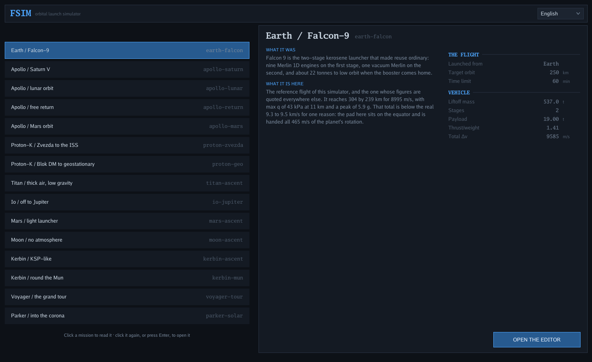
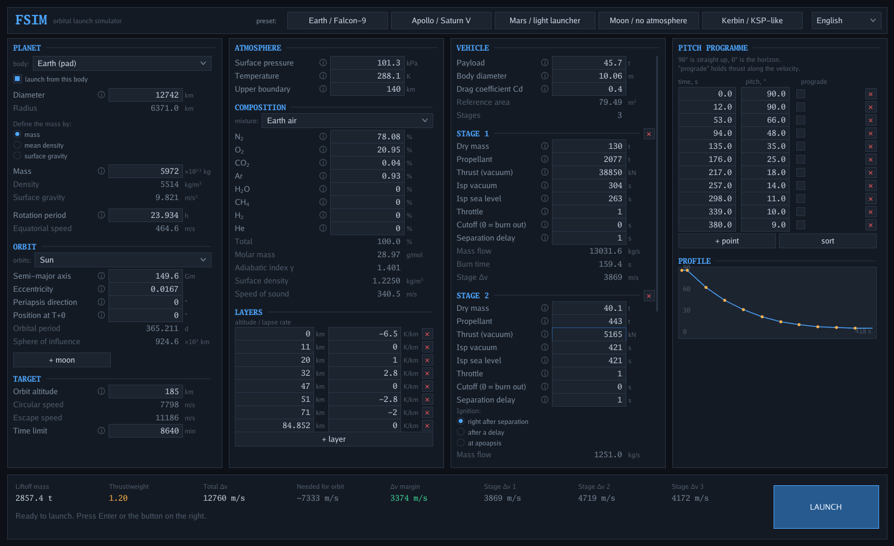
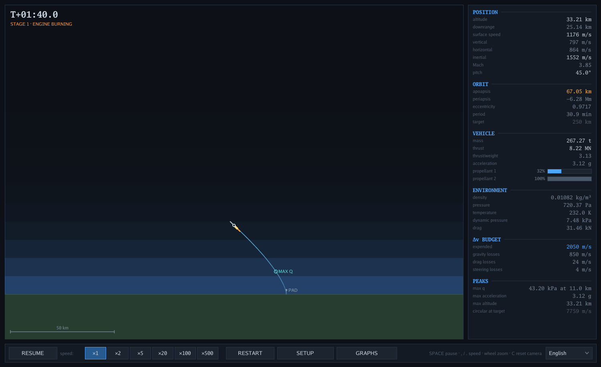
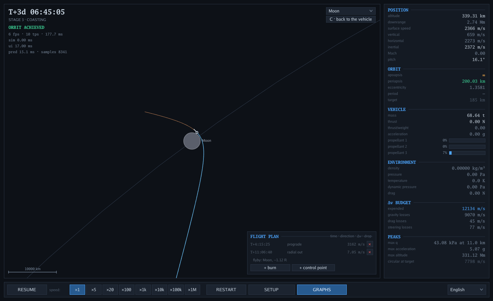
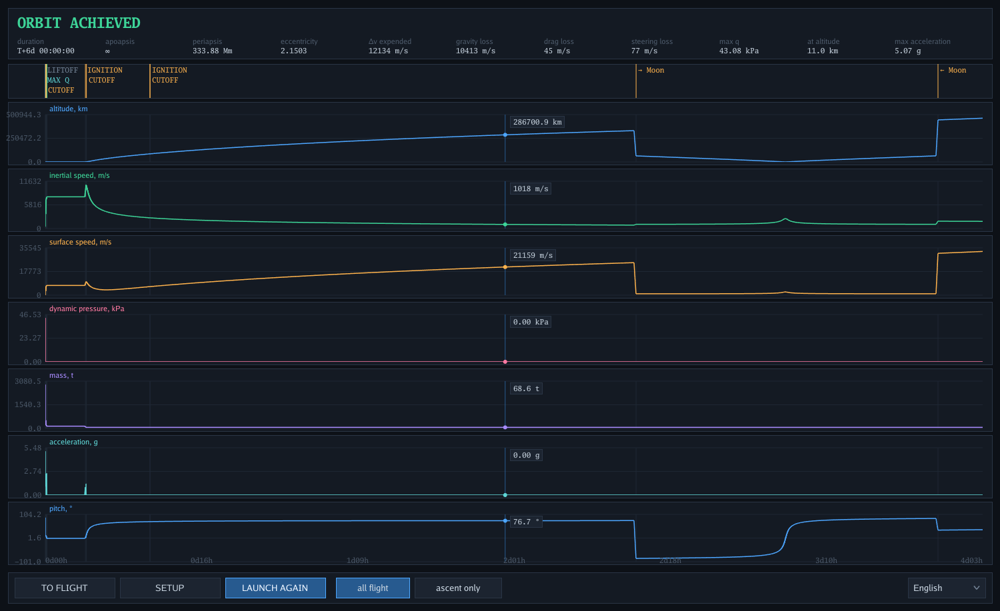

# fsim

A launch simulator that grew a solar system. Set up a planet — or any body of a system of eighteen — its
atmosphere, a vehicle of one to four stages, a pitch programme and a plan of burns. Press launch, watch it
fly with live telemetry, pull the camera back from the launch pad to the Moon's orbit, and read the graphs
when it is over.

The physics is real: gravity is integrated, propellant is spent, mass changes as it burns, the air pushes
back, and every body in the system pulls on the vehicle at once. Nothing is scripted, and nothing is on
rails except the planets themselves.

**[Fly it in a browser](https://pavel-krush.github.io/fsim/)** — the same program compiled to
WebAssembly, four megabytes over the wire, no install. The query string picks where to start:
[`?preset=apollo-mars`](https://pavel-krush.github.io/fsim/?preset=apollo-mars) for the hundred and
eighty-six days to Mars, [`?preset=apollo-return&lang=ru`](https://pavel-krush.github.io/fsim/?preset=apollo-return&lang=ru)
for the free return in Russian. Anything it does not recognise it ignores, so a mistyped link is still
a working simulator.



*Sixteen missions, and the identifier each one answers to — the same string `-preset` and `?preset=`
take. Clicking one reads it: what the real mission was, what this one does here, and the figures worth
knowing before flying it, all read off the configuration rather than flown. Clicking it again, or Enter,
opens the editor on it; naming one on the command line skips the list entirely.*



Locally, `web/build.sh` writes the same thing into `web/`; serve that directory over HTTP. Same
program, same physics — what costs in a browser is pixels rather than arithmetic.

## Running it

```
go run .                       # start on the mission list
go run . -lang ru              # start in Russian (default is English)
go run . -preset apollo-lunar  # start on a preset by name, not by position
go test ./...                  # physics and interface checks
```

## What is modelled

**The planet.** Radius plus one of {mass, mean density, surface gravity} — the other two are derived.
Rotation gives the launch site its own eastward velocity, which the rocket carries away with it, and
the atmosphere turns along with the ground. Any body of the system can be edited the same way, orbital
elements included, and you can give one a moon of its own or take one away.

**The atmosphere.** Layers with their own temperature gradients, integrated barometrically from the
surface conditions up. The gas mixture sets the molar mass and the adiabatic index, and through them
the scale height and the speed of sound. With Earth's composition and the standard layers, the model
reproduces the published ISA table to within half a per cent at every altitude.

**The rocket.** One to four stages, each with its own dry mass, propellant, thrust, throttle and
cutoff. Specific impulse is interpolated between sea level and vacuum against ambient pressure, so
thrust climbs as the air thins. Drag uses a coefficient and a reference area — no CFD, no shape.

**The flight.** Runge-Kutta 4 at a fixed 0.02 s step, shortened to land exactly on staging events. The
delta-v budget is accounted throughout and split into gravity, drag and steering losses, which is
usually the most interesting number on the screen.

**Coasting.** A vehicle that is only falling switches to an error-controlled step, so a coast that would
take thirteen million fixed steps takes a few hundred and the time warp goes to a million. Anything with
an engine running or air outside stays on the fixed step, and at ×1 so does everything else.

**The system.** The Sun, eight planets and nine major moons, with real radii, masses and orbits — all in
one plane, inclinations dropped. Bodies form a tree: a root that does not move, and moons and planets on
Keplerian rails about their parents. They all pull on the vehicle at once, and the state is kept relative
to whichever body's sphere of influence it is in, so the numbers stay small near a body and the telemetry
stays stays meaningful. The camera drags anywhere, zooms ten orders of magnitude from the launch pad to the whole
system, and locks onto the vehicle or any body in it to watch an approach from there.

**Manoeuvres.** Past the ascent the pitch programme has nothing useful to say, so a flight plan is a list
of burns: a time, a direction — prograde, retrograde, radial, or a held pitch — how much Δv to spend, and
whether to drop the stage that spent it. A stage can also be marked as lit by the plan rather than by the
staging sequence, which is what lets a spacecraft carry a spent booster through a coast and jettison it
with the burn that no longer needs it. The predicted path is drawn ahead of the vehicle with the plan flown
into it, which is the only way to aim a transfer at anything.

**The verdict.** Reaching orbit is a result, not an ending: the flight carries on, and the verdict can
still improve on itself — captured by a moon, or an impact, both naming the body they are about. What a
launch achieved stays on the record even after the vehicle has left.



*Max q on the Saturn V, with the flight plan open in the corner. It holds two entries: the translunar
injection as a delta-v, and a control point below it that says where to pass the Moon — the side and the
distance — for the simulation to solve when the moment comes.*



*Three days later, 200 km over the Moon, which is where Apollo 11 passed. The trail behind is what was
flown and the line ahead is the prediction; the periapsis in the panel reads 200.03 km because the pass is
aimed rather than hoped for, and the correction that held it cost 7 m/s.*

## Presets

Sixteen launchers, all of which actually reach orbit:

| | orbit | Δv spent | max q | peak |
|---|---|---|---|---|
| Earth / Falcon-9 | 304 × 239 km, e = 0.005 | 8995 m/s | 43.2 kPa at 11 km | 5.9 g |
| Apollo / Saturn V | 192 × 186 km, then 200 km over the Moon | 8965 m/s to orbit | 43.1 kPa at 11 km | 5.1 g |
| Apollo / lunar orbit | 1926 × 1776 km around the Moon, by period | 12852 m/s in all | 43.1 kPa at 11 km | 5.1 g |
| Apollo / free return | round the Moon and home, entry at 10975 m/s | 12157 m/s in all | 305 kPa at 32 km, on the way in | 14.5 g on entry |
| Apollo / Mars orbit | 95159 × 91094 km around Mars, T+186 d | 15030 m/s in all | 43.0 kPa at 11 km | 5.2 g |
| Proton-K / Zvezda | 513 × 408 km, the station's altitude | 9485 m/s | 31.9 kPa at 11 km | 3.7 g |
| Proton-K / Blok DM | 36087 × 35454 km, geostationary by period | 13282 m/s | 31.9 kPa at 11 km | 3.7 g |
| Ariane 5 / JWST to L2 | station at the Sun–Earth L2, 1.5 Mkm out | 12954 m/s in all | 61.3 kPa at 10 km | 6.4 g |
| Titan / thick air | 1212 × 1072 km | 4113 m/s | 19.5 kPa at 24 km | 0.68 g |
| Io / off to Jupiter | 58 × 43 km, then a Jupiter orbit crossing Io's | 2807 m/s in all | — | 0.60 g |
| Mars / light launcher | 249 × 195 km | 4511 m/s | 0.2 kPa at 13 km | 1.4 g |
| Moon / no atmosphere | 53 × 48 km | 1976 m/s | — | 0.55 g |
| Kerbin / KSP-like | 122 × 92 km | 3772 m/s | 38.4 kPa at 9 km | 3.9 g |
| Parker / into the corona | 29.2 solar radii at 107 km/s, past two Venus flybys | 9308 m/s to orbit, 19.7 km/s in all | 26.7 kPa at 11 km | 8.3 g |
| Voyager / the grand tour | Jupiter, Saturn, Uranus, Neptune, then out of the system | 16092 m/s in all | 57.6 kPa at 11 km | 5.0 g |
| Kerbin / round the Mun | 121 × 111 km around the Mun | 4950 m/s in all | 36.6 kPa at 9 km | 3.7 g |

Apoapsis first, and every figure is read where the run ends. That matters for the ones out at a moon or a
planet: those orbits are perturbed, so their numbers are a snapshot rather than a constant — the lunar
orbit above swings through some 150 km of apoapsis over the days it is watched. The peak column is real g
— 9.80665 m/s² — not local surface gravities, which is why a launch from Titan tops out at two thirds of
one.

The Earth figure comes in below the 9.3–9.5 km/s a real launcher spends because this one lifts off from
the equator and is handed all 465 m/s of the planet's rotation.

Apollo is the one preset that can be checked against a flight that happened. Staging at T+159 s against
the real T+161, insertion at T+604 s into 192 × 186 km against the real T+699 into 186 × 183. Then the
flight plan fires the translunar injection with what the S-IVB kept back, and two and a half days later
the vehicle is inside the Moon's sphere of influence, 200 km over the surface — where Apollo 11 passed,
and held there by a control point that costs 7 m/s, because a translunar injection is sharp enough that a
fixed number that close to the ground would be a crater waiting for the tenth digit to change. It leaves again: capturing
into lunar orbit needs 670 m/s and there are 540 left, which is the historical reason Apollo carried a
service module with an engine of its own. The lunar module's ride off the surface is the Moon preset.

The lunar-orbit preset is the same rocket, counted differently. The command and service module stops being
dead payload and becomes the fourth stage, so the flight plan can brake with the engine Apollo actually
braked with: translunar injection out of the parking orbit, the spent S-IVB dropped with it, and a
retrograde burn at the far end for a 1926 × 1776 km lunar orbit with the service module still half full.
That burn is written as the orbit it is for rather than as a delta-v — a control point on the period, which
solves to the 725 m/s a search once found. The
mass on the pad is the same to the kilogram.

The free return is the third Apollo, and the one that fires nothing after the injection. That burn is
the entire mission: five and a half minutes on the first morning, and everything about the arrival eight
days later follows from it. Past the Moon at 3226 km, back down through the top of the air at 10975 m/s
and 7.4° below the horizontal — Apollo's corridor was 6.5° — for a peak of 14 g. The real thing pulled
half that by flying its capsule as a wing; there is no lift anywhere in this model, so a ballistic dive
down the same corridor is what there is. The verdict for coming down on the planet you left is
`RETURNED HOME`, which took a new one: the vehicle has orbited, so calling it a crash claims it never got
there, and it has been away, so it is not a launch that fell over.

Mars is the fourth Apollo and the longest thing here: a hundred and eighty-six days, one burn at each
end. It is what the EMPIRE studies asked in 1962 — whether a Saturn V could be pointed at Mars — and the
answer turns on leaving the lander at home. Fifteen tonnes of lunar module off the payload takes the third
stage from 3668 m/s of throw to 4891, and 3668 does not reach Mars's orbit at any longitude whatever the
phasing. What flies is the command and service module alone, with the service module as the fourth stage,
braking at the far end into a 91094 × 95159 km orbit at e = 0.021 — a control point on the period again,
which solves to 2410 m/s. High, because a chemical stack
arrives with 3 km/s of hyperbolic excess and that is what there is to spend. Mars's mean anomaly in
`sim/solar.go` is the launch window: unlike every other phase in the system, that one number is data.

JWST is the one that goes somewhere that is not a body at all. The second Lagrange point of the Sun
and the Earth turns out to exist in this model rather than needing to be faked: the rails hold the
Earth to its orbit and the rail correction takes the Sun's pull at the Earth's centre back out of the
gravity sum, so a vehicle out there feels the restricted three-body problem, and an L2 is a solution
of that. It comes out 1.4763 million kilometres from the Earth — solved from the collinear condition
rather than approximated, and pulsating with the Earth's own eccentric year.

Ariane 5 to a parking orbit, the upper stage's leftovers for the transfer, and 1.5 million kilometres
in 33 days against the real 29. The insertion is where it gets interesting, because the point is a
*saddle*: a few metres a second under and the telescope falls back down the Earth's well, a few over
and it drifts off along the anti-Sun line, and neither a distance nor a period says which side of the
ridge the trajectory is on. So the burn is aimed at the point itself — the signed offset from it a
hundred and forty days later — which is monotone in delta-v precisely because the place is unstable,
and it solves to 264 m/s. One correction of 18 m/s at T+130 days then holds the telescope between
0.17 and 0.59 million kilometres of the point, never letting it back inside 1.31 million from the
Earth, on 49 kg of the 300 it carries. What that is not is a halo orbit: the real telescope flies a
periodic solution around the point for two or three metres a second a year, and finding one takes a
solver this model does not have.

Proton-K is here because it is *serial* — three stages in a line — and a list of stages can describe that
honestly. The R-7 family cannot be done that way: Vostok and Soyuz strap four boosters around a core and
burn them together, which a serial list can only lie about. This is the launch of July 2000 that put Zvezda
up: nineteen tonnes, and the launcher only gets it as far as an ellipse, because Proton's advertised
nineteen tonnes are to a couple of hundred kilometres and not to the station's four hundred. The third
stage cuts off with 3.3 t still in the tank, 43 m/s of it at the first apoapsis makes the orbit round, and
then it goes overboard and leaves the module with its own propellant untouched.

The same launcher with a Blok DM on top is the other thing Proton did for thirty years: a comsat to the
geostationary belt. Three burns — the third stage empties itself at the first periapsis and is dropped,
Blok DM lifts the far side to 35,786 km, and five and a half hours later it rounds the orbit off up there.
The measure of success is not the altitude but the period: 23.927 hours against the sidereal day's 23.934,
which for a real satellite is a slow drift east and a station-keeping budget.

Titan is the strangest ascent in the system and the one that took the most work. Four times Earth's surface
density under a seventh of its gravity: the air is thick enough that a rocket cannot go fast in it — 173 m/s
of terminal velocity at 22 kN of thrust — and so extended that it does not thin out to the density Earth's
own model stops at until 712 km, which is where a closed orbit starts. So the profile is nine minutes of
climbing straight up at a few hundred metres a second, a turn once the air is behind, and a kick stage at
apoapsis. Drag still costs 619 m/s and gravity 1860, against the 1682 it takes to be in orbit at all. The
vehicle is invented; the numbers are Titan's.

Parker is the other direction. It is the only preset that spends its energy going *down*: the
injection is aimed against the Earth's own motion, so what it buys is not distance but the loss
of heliocentric angular momentum, and every Venus flyby takes more away. Two of them — at 46 and
495 days, the second brought round by the resonance the first left — walk the perihelion from 39
solar radii to 29.2, where the vehicle passes at 107 km/s, inside Mercury's orbit. The flybys are
written as *aims* rather than as burns, so the corrections solve themselves in flight: 12 and 18
m/s of the 178 the spacecraft's hydrazine carries. That is also what makes the mission's figures
come out the same however the flight is advanced — hourly, two days at a time, or in one jump.
A third flyby is not available at any price this vehicle can pay: the next approach passes half a
million kilometres out. The real mission needed seven flybys over seven years to reach 9.9 radii,
and bought them with geometry rather than propellant.

The grand tour is the longest flight here and the only one that goes anywhere on borrowed
energy. One injection out of a parking orbit and four gravity assists: Jupiter at T+1.8
years and 41 radii, Saturn at 4.5 and 161, Uranus at 12.2 and 10, Neptune at 21.3 and 127,
and out of the system after that. None of it is thrust — the whole flight spends 16 km/s, of
which 9.2 went into reaching the parking orbit — but each encounter is *held* by a correction:
10.5 m/s in all, of the 300 the spacecraft's hydrazine carries. That is what makes the tour a tour rather than a
coincidence: a chain of four assists amplifies everything, including the difference between
one integration of a twenty-one-year coast and another, and without the corrections this one
passed Uranus on the wrong side and missed Neptune by 894 million kilometres when it was
integrated finely. With them the four encounters, the delta-v and the verdict are the same
whether the flight is advanced in six-hour steps or in one jump of thirty years.

The launcher is the Titan IIIE / Centaur, five stages in a line, which is why it is here
rather than a Delta: the two solid boosters burn first and alone, so a serial list can
hold the stack honestly. The Centaur is cut off seventy seconds into its burn with eleven
tonnes still aboard and the flight plan lights it again for the injection, which is what
the real one did too.

Io is the smallest sphere of influence anything launches into here: 7840 km, four and a third radii, so
there is barely room for an orbit and the parking orbit has to be a low one. Getting off Io is easy — 1809
m/s of circular speed at the surface and no air to speak of — and getting out of the sphere takes only
417 m/s, since the edge is four radii up rather than at infinity. The preset spends 750, a shade over the
739 a full escape costs, because that is the value whose Jupiter orbit does not wander back through Io's
sphere within the month. The verdict names Jupiter, because that is who has it now.

The Mun is the same launcher with 800 kg more propellant in the second stage, flown to a 111 × 121 km orbit
round a body of 200 km radius — up in nine minutes, away at T+2000 s, there five hours later. Kerbin and
the Mun are invented but the numbers are the game's: one g on a 600 km planet, a sixth of it on the moon,
twelve thousand kilometres out, and a sphere of influence of 2430 km. The single-planet `kerbin-ascent` preset is
left alone as a system of one body, because its figures are the ones quoted above.

Kerbin needs its second stage set to ignite at apoapsis: a 600 km planet wearing an Earth-thick 70 km
atmosphere does not yield to a direct ascent on a single burn.

## Flying it

The rocket is steered by a pitch programme — a table of times and angles, interpolated between, with
90° straight up and 0° along the horizon. A keyframe can instead be set to hold prograde. Stages cut
off on a timer or when the tanks run dry, and the upper stage can be told to light immediately, after
a delay, or at apoapsis.

Getting to orbit is a matter of pitching over neither too early, which flies you into the thick air,
nor too late, which spends everything climbing. The Δv losses panel tells you which mistake you made.

Every body has its own air, and the four in the solar system that have any worth flying through are Venus,
Earth, Mars and Titan — so a planet arrived at from somewhere else has an atmosphere to arrive *through*.
The setup screen's atmosphere column belongs to whichever body the first column is on, and a body with
none is offered some.

The mission list reads as well as chooses: the rows sit in a column on the left and the rest of
the screen describes whichever is selected — what the real mission was, what this version of it
does, and the figures, from liftoff mass to the flight plan's burns, before the editor's four
columns say how any of it is done. A click selects, a second click or Enter opens the editor,
and `-preset` skips the screen altogether, since naming a mission is the choice it exists for.

A burn in the flight plan can also be a *control point*: instead of a delta-v it carries an aim
— pass this body at four radii, or leave an orbit of this period — and the simulation solves for
the burn when the moment arrives, by bisecting over flown copies of the flight. That is what a
real trajectory correction is, and it is the only way a chain of gravity assists survives being
written down: a plan of fixed numbers is a plan solved for one exact path through the arithmetic,
and a close flyby amplifies the difference between that path and any other. An aim that cannot be
reached says so rather than pretending.

Seven of the sixteen missions are written that way. The grand tour holds each of its four encounters, and
Parker its two; Apollo's flyby is held 200 km over the Moon rather than standing off at 1800; the Mun pass
is held in a band ten metres a second wide that used to be a crater on either side; and three insertion
burns — Apollo's into lunar orbit, Apollo's into Mars orbit, and Blok DM's into the belt — are written as
the orbit they are for rather than as the delta-v that produces it, which is what an orbit insertion
actually is. They solve to 725, 2410 and 1472 m/s: the three figures a search once found, now derived
instead of remembered.

What an aim cannot do is hold a value the burn cannot straddle. Both Apollo insertions sit at an extremum
of the miss — every correction, either way, raises the periapsis — so there is no sign change for a
bisection to find, however close the aim is; that is why those two aim at their period instead. And a
correction only fixes what happens after it: the difference between two integrations of the same cruise is
upstream of the encounter, which is why a pass distance can move by radii while the mission's own figures
do not.

A setup you have edited can be kept: `SAVE` and `LOAD` in the setup header write it to one slot — a file
in your config directory, or `localStorage` in a browser — and a saved setup then gets a row of its own at
the bottom of the mission list.

On the flight screen: `SPACE` pauses, `,` and `.` change the time warp. Drag to move the view anywhere,
the wheel zooms about the pointer, the picker in the corner locks the camera to the vehicle or to any body
in the system, `TAB` cycles it and `C` hands the whole thing back to the automatic framing.

The graph screen puts the whole flight on one time axis, which for a lunar mission means four days with
the ascent in the first two pixels — so the axis drags and zooms, and there is a button for the launch on
its own.



*Six days of the Apollo flyby: the ascent is the spike at the left edge, the ruler above marks every event
including the Moon's sphere of influence being entered and left, and each column of a trace is drawn as the
range its samples covered — so a max-q spike between two pixels is still a spike.*

## Notes

Each body is painted its own colour — dull red Mars, tan Jupiter, pale gold Saturn with its rings — and
none of that is known to the physics, which carries identifiers and nothing else. Rings are decoration:
no mass, no shadow, and the C, B and A bands with the Cassini division between the last two, drawn
face-on because everything here shares one plane.


Written in Go with [Ebiten](https://ebitengine.org/). The interface toolkit is hand-rolled — Ebiten
ships no widgets — and the fonts are compiled in, so there are no assets to install and the binary
runs on its own.

`sim/` is the physics and depends on nothing but the standard library, which means it can be run and
tested without a window. `CLAUDE.md` records the decisions and the traps found along the way.
